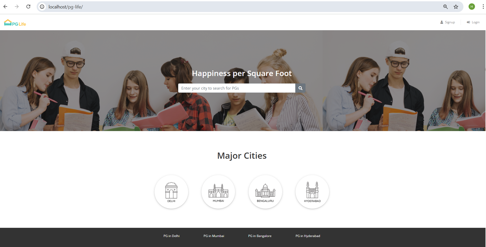
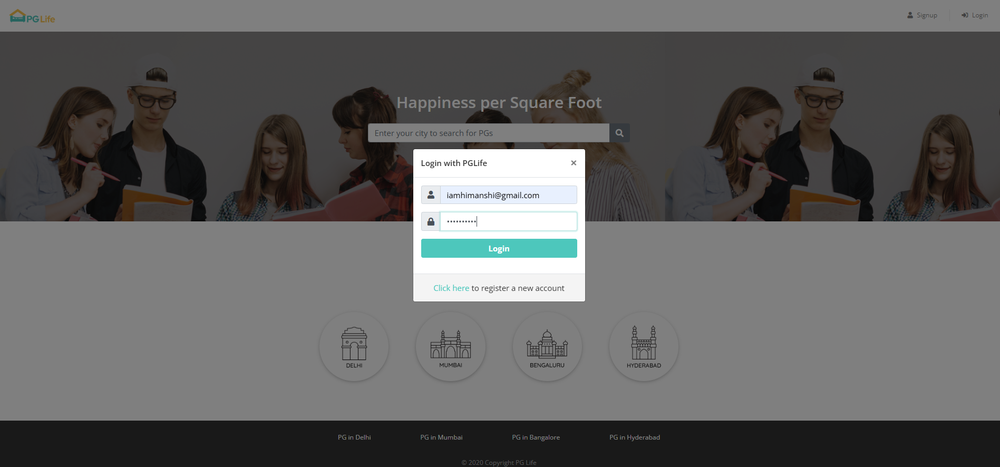
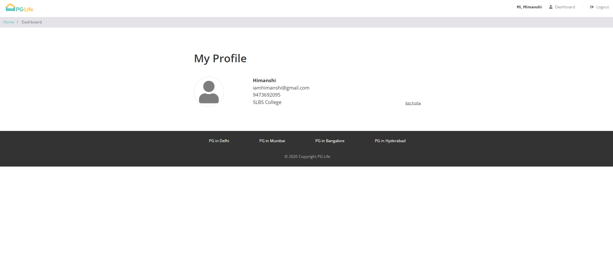
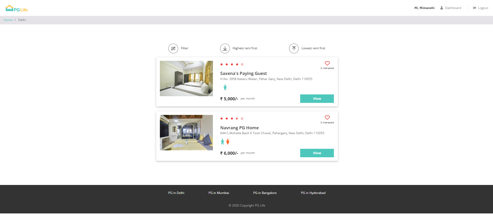

# 🏠 PG Life

A simple Frontend website for students to find PG accommodations in different cities.

## 🔧 Tech Used
- HTML, CSS, JavaScript
- PHP & MySQL
- XAMPP (localhost)
- 
## 📷 Screenshots
  

## 🚀 How to Run
1. Place folder in `htdocs`
2. Start Apache & MySQL from XAMPP
3. Import `pglife.sql` in phpMyAdmin
4. Visit: `http://localhost/pglife`
5. 
## 👩‍💻 Author
[Himanshi Tripathi](https://github.com/hi-mansi-64)
